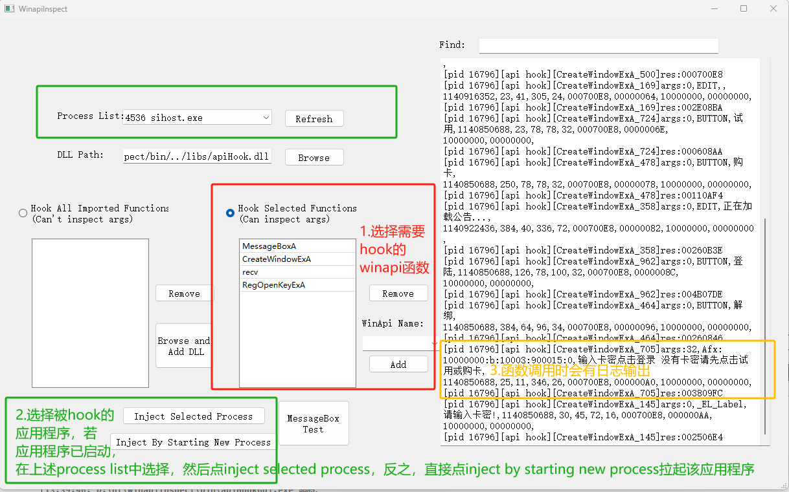
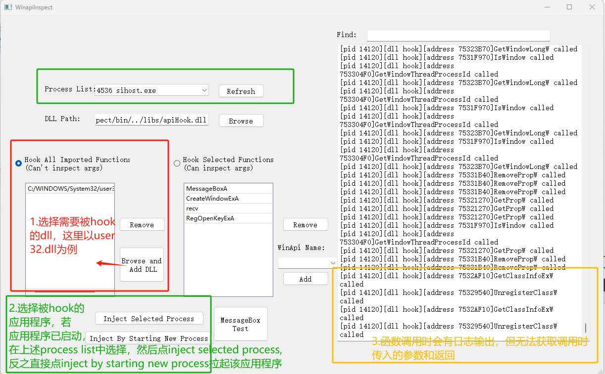

## 功能概述
在第三方应用程序几乎无感的状态下，获取

## 适配平台
windows

目前支持32位程序（64位程序的支持开发中...）
## 使用方式
支持两种方式

1. ApiHook：hook特定的某些windows api函数（在hook_function_def.txt中定义），能够看到被hook应用程序对这些api函数完整的调用过程，包括传入的所有参数，函数的实际返回结果等。缺点：a. 每次添加新函数后需要重新编译 b. 目前仅支持stdcall的函数调用方式 优点：对函数调用过程的记录十分详细
2. DllHook：hook某个或某些dll导出的所有函数，只能看到被hook应用程序是否调用了这些函数 缺点：只能看到函数是否被调用，无法观察到具体调用参数及返回 优点：a. 支持所有32位架构dll，无需重新编译 b. 可以迅速判断某个未知dll的哪些函数被应用程序调用

### ApiHook

### DllHook
